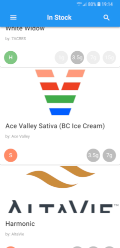

<h2 align="center">
  
   
  OCS Tracker
</h2>

	A fast, material design based tracker app for the <a href="https://ocs.ca">OCS</a>.

  

## Features

* :seedling: See what items are currently in stock
* :fire: Track recently stocked and sold out items
* :alarm_clock: Get email alerts for restocked and new items

## FAQ

- **Is this project affiliated with the OCS?**
    - This is a personal project and is not affiliated with the OCS in any way.

- **How is the data obtained?**
    - All data is taken directly from the [ocs.ca](https://ocs.ca) website and is strictly based on public data.

- **What items are tracked?**
    - Only dried flower products are tracked.

- **How precise is the tracking?**
    - Stock data is currently updated at `5m` intervals. Alerts are generated and sent immediately after.

- **What does low stock mean?**
    - Any products that only have 1g variants in stock are considered low.

- **Is there a purely native app for this?**
    - No. However you can add the web app to your home screen on iOS and Android. For Android users who want a clean homescreen you can also install the standalone APK from the [releases](https://github.com/brentlintner/ocs-tracker/releases) page.

## Support

Issue Tracker is on [GitHub](https://github.com/brentlintner/ocs-tracker/issues).

## Contributing

See [Contribute.md](CONTRIBUTE.md).

## License

- **[MPL 2.0 license](LICENSE)**
- Copyright 2019 [Brent Lintner](https://github.com/brentlintner) and contributors.
